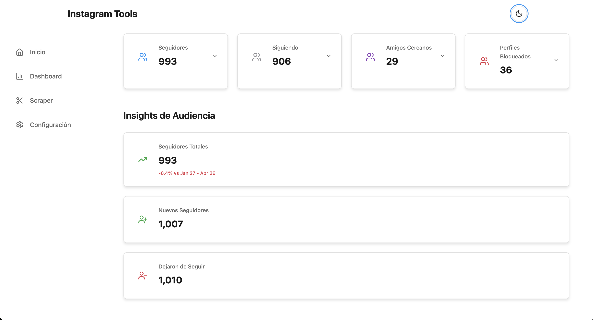
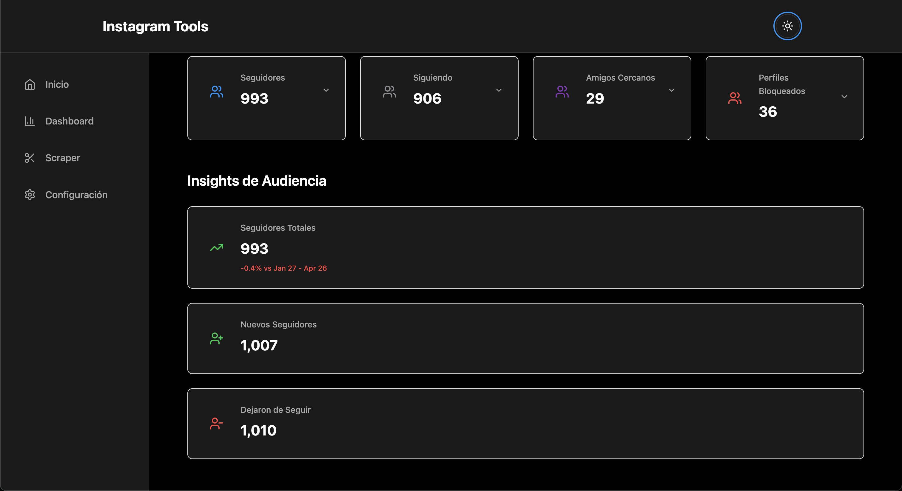
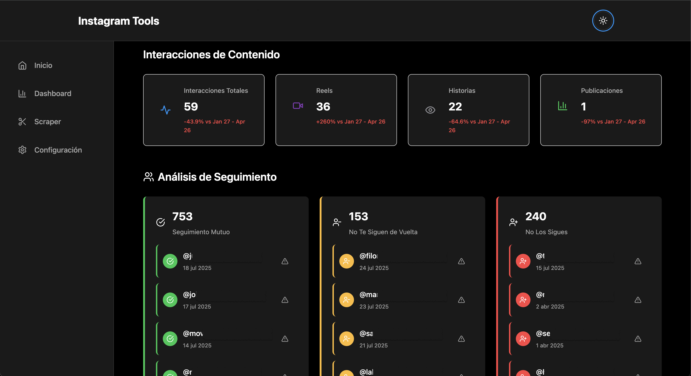

# Instagram Tools - Sistema Modular

Sistema modular para análisis de datos de Instagram con dashboard y scraper independientes.

## 🏗️ Arquitectura

### Módulos Disponibles

- **Dashboard**: Visualización y análisis de datos de Instagram
- **Scraper**: Herramienta de scraping con backend Django y frontend SvelteKit
- **App Shell**: Navegación integrada para acceder a todos los módulos

### Servicios

- `app-shell`: Navegación integrada (SvelteKit)
- `dashboard`: Frontend SvelteKit para visualización de datos
- `scraper-backend`: API Django para scraping de Instagram
- `scraper-frontend`: Interfaz SvelteKit para el scraper

## 🚀 Inicio Rápido

### Opción 1: Makefile (Recomendado)
```bash
# Iniciar en modo desarrollo (App Shell + Dashboard + Scraper)
make up-dev

# Ver otros comandos disponibles
make help
```

### Opción 2: Script Interactivo
```bash
chmod +x start.sh
./start.sh
```

### Opción 3: Comandos Directos

```bash
# Solo Dashboard
docker compose --profile dashboard up -d

# Solo Scraper (Backend + Frontend)
docker compose --profile scraper --profile scraper-ui up -d

# Dashboard + Scraper completo
docker compose --profile dashboard --profile scraper --profile scraper-ui up -d

# App Shell + Dashboard + Scraper (modo desarrollo completo)
docker compose --profile shell --profile dashboard --profile scraper --profile scraper-ui up -d
```

## 🌐 URLs de Acceso

- **App Shell (navegación integrada)**: http://localhost:3000
- **Dashboard**: http://localhost:5174
- **Scraper Frontend**: http://localhost:5173/scraper
- **Scraper Backend API**: http://localhost:8000

## 📋 Perfiles Disponibles

- `shell`: App Shell (navegación integrada)
- `dashboard`: Solo el dashboard de visualización
- `scraper`: Backend del scraper (Django API)
- `scraper-ui`: Frontend del scraper (SvelteKit)

## 🔧 Comandos Makefile

```bash
make up-dev    # Iniciar en modo desarrollo (App Shell + Dashboard + Scraper)
make down      # Detener todos los servicios
make logs      # Ver logs de todos los servicios
make ps        # Ver estado de los servicios
make build     # Reconstruir todas las imágenes
make clean     # Limpiar contenedores y volúmenes
make help      # Mostrar ayuda
```

## 📁 Estructura del Proyecto

```
Instagram_Tools/
├── app-shell/           # Navegación integrada (SvelteKit)
├── dashboard_web/       # Dashboard SvelteKit
├── scraper/            # Módulo Scraper
│   ├── backend/        # Django API
│   └── frontend/       # SvelteKit UI
├── docker-compose.yaml # Configuración Docker
├── Makefile           # Comandos de desarrollo
├── start.sh           # Script de inicio interactivo
└── README.md          # Documentación
```

## 🔌 Variables de Entorno

Copia `env.example` a `.env` y configura:

```bash
# Dashboard
VITE_SCRAPER_API_URL=http://scraper-backend:8000

# Scraper Backend
DEBUG=True
SECRET_KEY=your-secret-key-here
CORS_ALLOWED_ORIGINS=http://localhost:5174,http://127.0.0.1:5174,http://dashboard:5173,http://localhost:5173,http://127.0.0.1:5173,http://scraper-frontend:5173

# Scraper Frontend
VITE_API_URL=http://scraper-backend:8000
NODE_ENV=development
```

## 🛠️ Desarrollo

### Inicio Rápido
```bash
# Iniciar todo el sistema
make up-dev

# Ver logs
make logs

# Detener
make down
```

### Desarrollo Individual

#### Dashboard
```bash
cd dashboard_web
npm install
npm run dev
```

#### Scraper Backend
```bash
cd scraper/backend
pip install -r requirements.txt
python manage.py runserver
```

#### Scraper Frontend
```bash
cd scraper/frontend
npm install
npm run dev
```

## 🔍 Solución de Problemas

### Error de Conexión
Si el dashboard no puede conectar con el scraper:
1. Verifica que ambos servicios estén ejecutándose: `make ps`
2. Revisa los logs: `make logs`
3. Asegúrate de que las variables de entorno estén correctas

### Error de Puerto
Si hay conflictos de puertos:
```bash
# Detener todos los contenedores
make down

# Limpiar contenedores huérfanos
make clean
```

### Reconstruir Imágenes
```bash
make build
```

### Problemas con App Shell
Si el app-shell no puede acceder a las apps:
1. Verifica que todos los servicios estén ejecutándose
2. Asegúrate de usar `make up-dev` para iniciar todo el sistema
3. Revisa los logs del app-shell: `docker compose logs app-shell`

## 📝 Notas

- Cada módulo es completamente independiente
- Los servicios se comunican a través de la red Docker
- El dashboard puede conectarse al scraper para funcionalidades integradas
- El app-shell proporciona navegación integrada para todos los módulos
- Usa `make up-dev` para el desarrollo más rápido
- El script `start.sh` permite selección interactiva de módulos

## 🚀 Flujo de Trabajo Recomendado

1. **Desarrollo**: `make up-dev`
2. **Ver logs**: `make logs`
3. **Ver estado**: `make ps`
4. **Detener**: `make down`
5. **Limpiar**: `make clean` 

## 📝 Notas

- Cada módulo es completamente independiente
- Los servicios se comunican a través de la red Docker
- El dashboard puede conectarse al scraper para funcionalidades integradas
- El app-shell proporciona navegación integrada para todos los módulos
- Usa `make up-dev` para el desarrollo más rápido
- El script `start.sh` permite selección interactiva de módulos

## 🚀 Flujo de Trabajo Recomendado

1. **Desarrollo**: `make up-dev`
2. **Ver logs**: `make logs`
3. **Ver estado**: `make ps`
4. **Detener**: `make down`
5. **Limpiar**: `make clean` 

## 📸 Capturas de Pantalla

| Vista general | Tarjetas | Listas |
|---------------|----------|--------|
|  |  |  | 

## 🖼️ Previews Adicionales





 